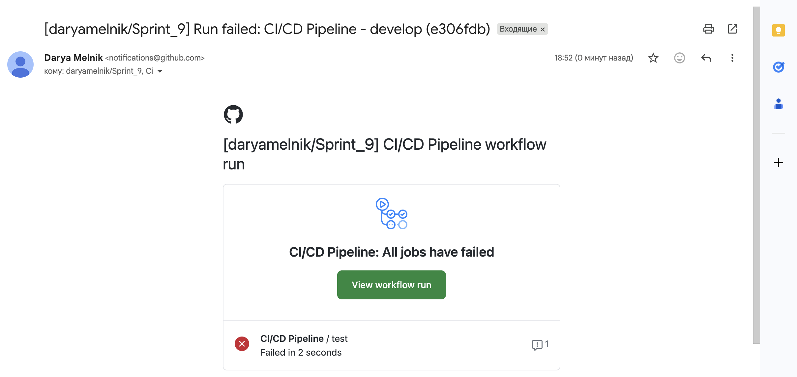

# Sprint_9

## Установка

```bash
pip install -r requirements.txt
```

## Запуск тестов

```bash
pytest -v --alluredir=allure-results
```

## Allure отчёт

```bash
allure serve allure-results
```

## CI/CD Pipeline

Проект настроен с CI/CD на базе GitHub Actions. Пайплайн автоматически запускается при пуше в ветки `main`, `develop` или `master`.

### Скриншот успешного пайплайна



### Структура CI/CD

- **Dockerfile** - для сборки образа проекта с тестами
- **docker-compose.yml** - для сборки проекта с Selenoid
- **.github/workflows/ci.yml** - конфигурация GitHub Actions для автоматического запуска тестов
